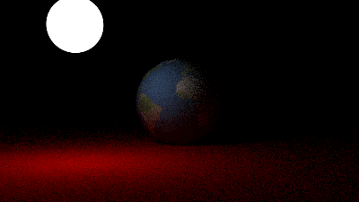

Ray Tracer
===

Ray tracer implemented in Rust, with support for materials, textures, lighting,
random noise, and other bits.

Built heavily on the [Ray Tracing in One Weekend](https://raytracing.github.io/)
series, also incorporating elements from [pbrt](https://pbrt.org/).

Gallery
---

